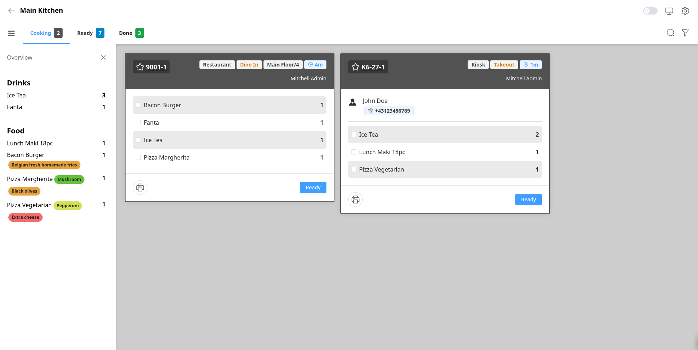

---
hide:
  - navigation
---

# Demo

Try the module without installing it.

**Live demo:** <https://odoo19-pos.504050.xyz/odoo/point-of-sale>

Open the Point of Sale, take an order, and watch it appear on the Kitchen Display.

!!! tip "Companies"

    Switch between companies to see different configurations. Each company can have its own kitchen displays.
    
    - **Default**: Kitchen Display with Cooking, Ready, and Done stages.
    - **Prep Rules and Dispatcher**: Workflow with two kitches to prepare food and a bar to prepare drinks. The second kitchen has a separate grill station for burgers.

/// caption
Kitchen Display showing Cooking, Ready, and Done stages.
///
