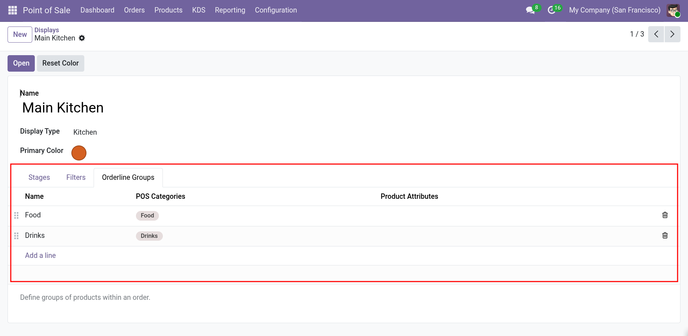

# Configure the KDS

This page covers the filters, order line groups, and on-screen settings of a
Kitchen Display.

## Filters

Open the **Filters** tab of a display.

| Field | Description |
| --- | --- |
| **Point of Sale** | The Points of Sale whose orders appear on the display. Leave empty for **all** Points of Sale. |
| **Order Domain** | A domain on `pos.order` that filters which orders appear. |
| **Order Line Domain** | A domain on `pos.order.line` that filters which order lines appear. |

Both domains use the standard Odoo domain syntax. The default `[]` includes
everything. Use them to hide, for example, a specific product or a specific floor.

> Only orders from **open POS sessions** are loaded. The order domain is applied on
> top of that.

## Order line groups

**Order line groups** group the products of an order into sections on the display,
for example *Appetizer*, *Main*, and *Dessert*.

Open the **Orderline Groups** tab of a display.

| Field | Description |
| --- | --- |
| **Sequence** | The order of the groups. |
| **Name** | The section title. |
| **POS Categories** | The categories to include. Subcategories are included automatically. |
| **Product Attributes** | Optional attribute values to include. |


*Screenshot placeholder: Orderline Groups tab with categories and attributes.*

## On-screen settings

Click the gear icon in the top-right corner of the display to open the settings drawer.

| Setting | Description |
| --- | --- |
| **Products** | Enable or disable individual dishes. Requires `abichinger_pos_stock`. |
| **Current wait time** | The wait time in minutes shown to customers. Set to `0` to disable. Requires `aks_self_order`. |
| **Zoom** | Adjust the zoom level of the display. |
| **Merge order changes** | Merge several changes of the same order into one card. |
| **Order of orders** | Sort by **duration**, **tracking number**, or **takeout time**. |
| **Time format** | Show elapsed time as `m`, `mm:ss`, or `hh:mm:ss`. |
| **Print Mode** | Print mode for the local printer: **Text** or **Image**. |
| **Cleanup** | Delete the database records of closed sessions. |
| **Reset** | Reset all settings to their defaults. |

> Settings are stored in the browser. Create a bookmark to save your settings for a
> display.

## Filters panel

Click the filter icon to open the filter panel. Depending on the data, you can filter
by:

- **Points of Sale**
- **PoS Presets**
- **Product Categories**
- **Floors**

## Display features

| Feature | Description |
| --- | --- |
| **Stages** | Switch between stages with the tabs at the top. |
| **Overview** | A side panel that summarizes the items still to be prepared, grouped by category. |
| **Search** | Search orders on the current stage. |
| **Dark mode** | Toggle between light and dark mode. |
| **Priority** | Click the star on an order to mark it as high priority. |
| **Order status screen** | Open the order status screen. Requires `ab_pos_order_status`. |
| **Customer details** | Show the customer name, phone, email, and address. |
| **Order line timeline** | Show the changes made to an order line. |

## URL parameters

You can control the display with URL parameters. This is useful for kiosk setups and
bookmarks.

| Parameter | Description |
| --- | --- |
| `ks` | The ID of the Kitchen Display. Required. |
| `name` | A name for the display. |
| `select` | The ID of the initially selected stage. |
| `menu` | Set to `hide` to hide the stage menu. |
| `overview` | Set to `show` to open the overview panel. |
| `theme` | The theme, for example `dark`. |
| `merge` | Set to `true` to merge order changes. |
| `order` | The sort order index. |
| `tf` | The time format: `m`, `mm:ss`, or `hh:mm:ss`. |
| `pm` | The print mode: `text` or `img`. |
| `zoom` | The zoom level. |
| `debug` | Enable the debug menu. |
| `categ` | Filter by product category ID. Repeatable. |
| `floor` | Filter by floor ID. Repeatable. |
| `pos` | Filter by Point of Sale ID. Repeatable. |
| `preset` | Filter by PoS preset ID. Repeatable. |

Example:

```
/abichinger_kitchen_screen/app/?ks=1&theme=dark&overview=show
```

## Real-time updates

The display updates in real time over a WebSocket connection. If the connection is
lost, a warning appears at the top of the screen. See
[Troubleshooting](../troubleshooting.md) for proxy configuration.
