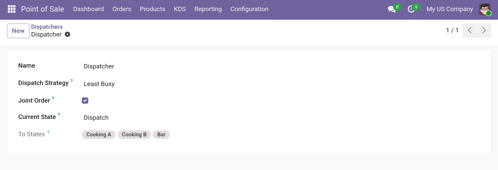

# Dispatchers

A **Dispatcher** sends items to one of several destinations. Use it when the same
product can be prepared in more than one kitchen and you want to balance the load.

Open **Point of Sale ‣ KDS ‣ Dispatchers**.

| Field | Description |
| --- | --- |
| **Name** | A name for the dispatcher. |
| **Dispatch Strategy** | **Least Busy** or **Round Robin**. |
| **Joint Order** | Keep all lines of the same order together (see below). |
| **Current State** | The state of the order change line when the dispatcher is used. |
| **Item Routes** | Read-only. The routes used by this dispatcher. |
| **To States** | Read-only. The possible destinations. |

The **Item Routes** and **To States** fields are computed from the item routes whose
**From State** equals the dispatcher's **Current State** and whose type is not
**Canceled**.

## Dispatch strategies

| Strategy | Behavior |
| --- | --- |
| **Least Busy** | Picks the destination with the fewest open order change lines. |
| **Round Robin** | Picks the next destination in a circular fashion. |

## Joint Order

When **Joint Order** is enabled, all order change lines of the same order that resolve
to the same destination are dispatched together. The assignment is remembered for the
order, so later lines follow the same destination.

## How a dispatcher runs

1. An item moves to a state.
2. If a dispatcher exists for that state, it runs.
3. The dispatcher resolves the matching routes for each line's product.
4. If several routes match, the strategy picks one destination.
5. The item is moved to the chosen destination.

## Example: two kitchens

1. Create two item states, for example *Kitchen A* and *Kitchen B*.
2. Create two item routes from *Dispatch*: one to *Kitchen A* and one to *Kitchen B*.
3. Create a dispatcher with **Current State** = *Dispatch* and strategy **Least Busy**.
4. When an item enters *Dispatch*, the dispatcher sends it to the less busy kitchen.

/// caption
Dispatcher with strategy and computed to states.
///
