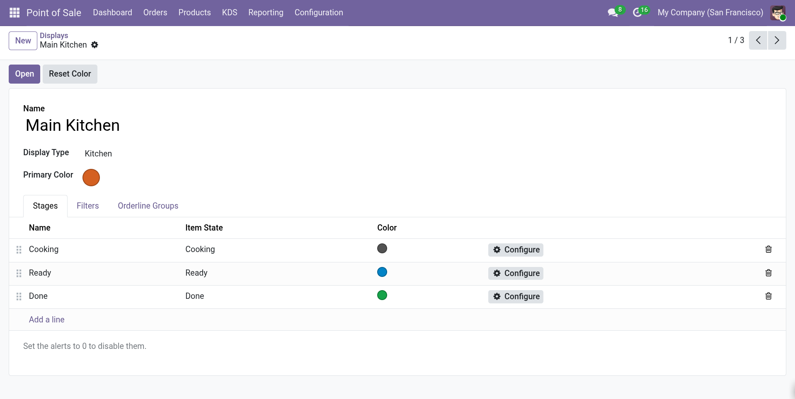
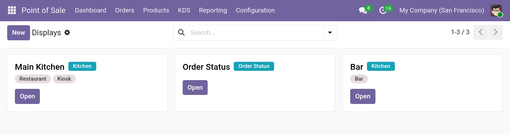

# Set up a Kitchen Display

A **Kitchen Display** is one screen in the kitchen. Create one display per kitchen,
station, or device. You can run as many displays as you need.

## Create a display

1. Open **Point of Sale ‣ KDS ‣ Displays**.
2. Click **New**.
3. Fill in the fields:

| Field | Description |
| --- | --- |
| **Name** | A name for the display, for example *Main Kitchen*. |
| **Display Type** | The type of display. **Kitchen** or **Order Status** (requires [**POS Order Status Screen**]). | 
| **Sequence** | The order of the display in the list. |
| **Primary Color** | An optional accent color for the display. |
| **Point of Sale** | The Points of Sale whose orders appear on this display. Leave empty to include **all** Points of Sale. |
| **Order Domain** | An advanced filter for orders (see [Configure the KDS](configuration.md)). |
| **Order Line Domain** | An advanced filter for order lines (see [Configure the KDS](configuration.md)). |

4. Configure the **Stages**.
5. Save the record.

*Kitchen Display form with the Stages, Filters, and Orderline Groups tabs.*

## Stages

A **stage** is a column on the Kitchen Display. Each stage is linked to an
[Item State](item-states-routes.md) and defines how items in that state look and behave.

### Default stages

A new display starts with three stages:

| Sequence | Name | Item State | Color |
| --- | --- | --- | --- |
| 0 | Cooking | Cooking | `rgb(82 82 82)` |
| 1 | Ready | Ready | `rgb(2 132 199)` |
| 2 | Done | Done | `rgb(22 163 74)` |

You can rename, reorder, add, or remove stages. Each display has its own stages.

### Stage fields

Open a stage from the **Stages** tab of the display by clicking the gear icon next to it.

| Field | Description |
| --- | --- |
| **Sequence** | The order of the stage on the screen. |
| **Name** | The title shown on the stage. |
| **Item State** | The item state this stage displays. |
| **Color** | The color of the stage tab and order tickets. |
| **Orange Alert** | After this many minutes, the order turns orange. `0` disables the alert. |
| **Red Alert** | After this many minutes, the order turns red. `0` disables the alert. |
| **Notification Sound** | The sound played when an order enters this stage. |
| **Show Move Buttons** | Show the buttons that move items to the next or previous stage. |

### Rules and constraints

- A stage name must be unique within a display.
- An item state can be used by only one stage per display.
- Items whose state has no stage are not shown on the display. The default
  **Done → Hide** route uses this to remove finished items from the screen.

<!-- 
*Screenshot placeholder: Stage form with color, alerts, and notification sound.* -->

## Open a display

You can open a display in two ways:

- **From the display record:** click **Open** in the form or on the kanban card.
  This opens `/abichinger_kitchen_screen/app/?ks=<id>` in a new tab.
- **From the POS dashboard:** open a POS session, then click **Kitchen Screen** on the
  POS card. This button appears when the session is open and at least one display is
  linked to the Point of Sale.

!!! info "Access"

    Only internal users can open the Kitchen Display.

## Link displays to a Point of Sale

A display shows orders from the Points of Sale selected in its **Point of Sale** field.
You can set this from either side:

- On the display: **Point of Sale** field.
- On the Point of Sale: **Settings ‣ Kitchen Screens**.

If the **Point of Sale** field is empty, the display includes orders from every
Point of Sale.

## Run several displays

Create one display per kitchen or station and assign the relevant Points of Sale.
Each display keeps its own stages, filters, and settings. Use the **Sequence** field
to control the order in the Displays list.

*Displays kanban view with several kitchen screens.*
