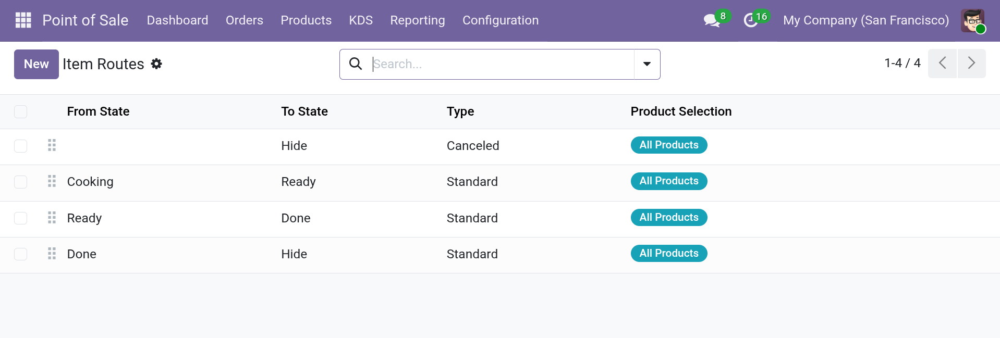

# Item States and Item Routes

**Item States** and **Item Routes** define the workflow of an item on the Kitchen
Display. Together they decide which stage an item is in and where it can move next.

- An **Item State** is a step in the workflow, for example *Cooking* or *Ready*.
- An **Item Route** is a transition from one state to another, for example
  *Cooking → Ready*.

## Item States

Open **Point of Sale ‣ KDS ‣ Item States**.

| Field | Description |
| --- | --- |
| **Sequence** | The order of the states. |
| **Name** | The name of the state. |
| **Default** | Read-only. The first state by sequence is the default state for new order lines. |

### Default item states

| Sequence | Name |
| --- | --- |
| 10 | Cooking |
| 20 | Ready |
| 30 | Done |
| 40 | Hide |

The state with the lowest sequence is the **default state**. New order lines start in
this state.

## Item Routes

Open **Point of Sale ‣ KDS ‣ Item Routes**.

| Field | Description |
| --- | --- |
| **Sequence** | The order in which routes are evaluated. |
| **From State** | The state the item moves from. Leave empty to make the route active for **all** states. |
| **To State** | The state the item moves to. Required. |
| **Type** | **Standard**, **Dispatcher**, or **Canceled** (see below). |
| **Product Filter** | Restricts the route to certain products (see below). |

### Route types

| Type | When it is available |
| --- | --- |
| **Standard** | Always available. |
| **Dispatcher** | Only available to [dispatchers](dispatchers.md). |
| **Canceled** | Only available for canceled orders. |

### Default item routes

| Sequence | From State | To State | Type |
| --- | --- | --- | --- |
| 5 | *(any)* | Hide | Canceled |
| 10 | Cooking | Ready | Standard |
| 20 | Ready | Done | Standard |
| 30 | Done | Hide | Standard |

With these defaults, a canceled order moves to **Hide**, and a normal order moves
*Cooking → Ready → Done → Hide*.

### Product filter

Use the product filter to apply a route to specific products only:

| Option | Description |
| --- | --- |
| **All Products** | The route applies to every product. |
| **List of Products** | The route applies to the selected products. |
| **PoS Categories** | The route applies to products in the selected categories, including subcategories. |
| **Domain** | The route applies to products matching a domain. |

## How a route is chosen

When an item moves, the display looks for a matching route:

1. The route's **From State** must match the item's current state, or be empty.
2. The route's **Type** must match the situation: **Canceled** for canceled orders,
   **Standard** otherwise.
3. The route's **Product Filter** must match the product.
4. If several routes match, the one with the lowest **Sequence** is used.

/// caption
Item Routes list with default routes.
///
